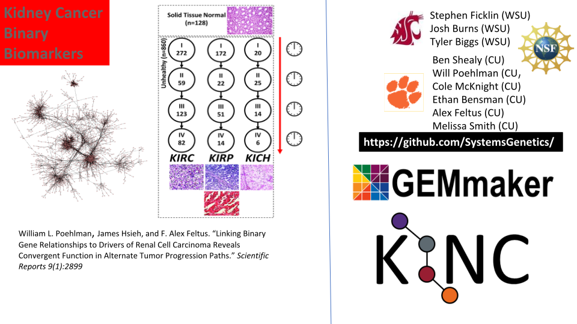

## Experiences using Singularity on Palmetto Cluster at Clemson University

### Ashwin Srinath, Computational Scientist


## Outline

* About Palmetto Cluster at Clemson University
* Quick introduction to Singularity
* Use cases
* Researcher stories
* Demos:
  - Singularity + MPI
  - Pulling images from the NVIDIA GPU Cloud and deploying on JupyterHub (RAPIDS)
  - Large dataset visualization with Paraview


## About Palmetto Cluster

```bash
$ cat /etc/hardware-table

 PHASE COUNT  MAKE   MODEL    CHIP(0)                CORES  RAM(1)     GPUs
  1     75    Dell   PE1950   Intel Xeon    E5345       8    12 GB      0
  2a   158    Dell   PE1950   Intel Xeon    E5410       8    12 GB      0
  2b    84    Dell   PE1950   Intel Xeon    E5410       8    16 GB      0
  3    225    Sun    X2200    AMD   Opteron 2356        8    16 GB      0
  4    326    IBM    DX340    Intel Xeon    E5410       8    16 GB      0
  5a   320    Sun    X6250    Intel Xeon    L5420       8    32 GB      0
  5b     9    Sun    X4150    Intel Xeon    E5410       8    32 GB      0
  6     67    HP     DL165    AMD   Opteron 6176       24    48 GB      0
  7a    42    HP     SL230    Intel Xeon    E5-2665    16    64 GB      0
  7b    12    HP     SL250s   Intel Xeon    E5-2665    16    64 GB      2(3)
  8a    71    HP     SL250s   Intel Xeon    E5-2665    16    64 GB      2(4)
  8b    57    HP     SL250s   Intel Xeon    E5-2665    16    64 GB      2(4)
  8c    88    Dell   PEC6220  Intel Xeon    E5-2665    16    64 GB      0
  9     72    HP     SL250s   Intel Xeon    E5-2665    16   128 GB      2(4)
 10     80    HP     SL250s   Intel Xeon    E5-2670v2  20   128 GB      2(4)
 11a    40    HP     SL250s   Intel Xeon    E5-2670v2  20   128 GB      2(6)
 11b     4    HP     SL250s   Intel Xeon    E5-2670v2  20   128 GB      0
 12     30    Lenovo NX360M5  Intel Xeon    E5-2680v3  24   128 GB      2(6)
 13     24    Dell   C4130    Intel Xeon    E5-2680v3  24   128 GB      2(6)
 14     12    HP     XL1X0R   Intel Xeon    E5-2680v3  24   128 GB      2(6)
 15     32    Dell   C4130    Intel Xeon    E5-2680v3  24   128 GB      2(6)
 16     40    Dell   C4130    Intel Xeon    E5-2680v4  28   128 GB      2(9)
 17     20    Dell   C4130    Intel Xeon    E5-2680v4  28   128 GB      2(9)
 18a     2    Dell   C4140    Intel Xeon    6148G      40   372 GB      4(10)
 18b    65    Dell   R740     Intel Xeon    6148G      40   372 GB      2(11)
 18c    10    Dell   R740     Intel Xeon    6148G      40   748 GB      2(11)
 ```

 
## The basic Singularity workflow

1. Build on machine with root access (creates a **single** file `application.simg`).

   ```bash
   $ sudo singularity build application.simg Singularity.recipe 
   ```
 
2. Copy `application.simg` to another host (e.g., HPC cluster, cloud). No root access required.

3. Run container on second host:

   ```bash
   $ singularity exec application.simg /path/to/app
   ```
   

## What makes Singularity great for HPC?

* **Single file format** makes it easy to move around and deploy containers

* Compatibility with Docker images (no need to have Docker installed),
  enable you to pull from:
  - DockerHub
  - Nvidia GPU Cloud (NGC)
  
  ```bash
  $ singularity pull docker://ubuntu
  ```
  
* Native support for GPUs. Just pass `--nv` to bind GPU drivers from host to container:

  ```bash
  $ singularity exec --nv /path/to/application.simg /path/to/app
  ```

* Native support for MPI


## Use cases

* Administrators:
  - Provisioning software: has saved us many hours (sometimes days) that would have been
    spent installing and configuring software and dependencies for user applications
    
  - Containerized services: (JupyterHub, XdMod) allows us to test user-facing services locally,
    and deploy on the cluster with ease.
    
    <https://github.com/clemsonciti/xdmod-singularity>

* Users
  - Self-managed software environments: users' long-held fantasies of using `apt-get` on the cluster
    are realized
    
  - Reproducible workflows


## Deploying Singularity: modules

* Modules remain the most-used tool for software management
by users.

* Singularity's **single file format** makes it very easy
to deploy Singularity containers as software modules:

```bash
$ module load grass
$ which grass
alias grass='singularity exec \
    -B /software:/software
    -B /scratch2:/scratch2 \
    -B /local_scratch:/local_scratch \
    /software/singularity-images/grass-gis-stable.img /usr/local/bin/grass' 
/software/singularity/2.5.2/bin/singularity
$ grass # launches grass - as expected
```

## Deploying Singularity: JupyterHub


* Multi-user hub for Notebook Servers
* Preferred way of using the cluster for significant (10-20%) number of users
* Growing number of applications are Python/R based with complex dependencies
* Q: How to deploy Singularity in Jupyter Notebooks?

## Deploying Singularity: JupyterHub

Simple change to `kernel.json`:

<div id="left">

```json
{
 "display_name": "Python 3",
 "language": "python",
 "argv": [
  "/software/anaconda/4.2.0/bin/python",
  "-m",
  "ipykernel",
  "-f",
  "{connection_file}"
 ],
}
```

</div>

<div id="right">

```json
{
 "display_name": "Python 3"
 "language": "python",
 "argv": [
   "/path/to/singularity",
   "exec",
   "/path/to/image.sif",
   "/usr/bin/python",
   "-m",
   "ipykernel",
   "-f",
   "{connection_file}"
 ],
}
```

</div>

## Case study:




## Case study:


## Demos

1. Singularity + MPI
2. Pulling images from the NVIDIA GPU Cloud and deploying on JupyterHub (RAPIDS)
3. Large dataset visualization with Paraview


## Thanks!

<https://github.com/clemsonciti>
